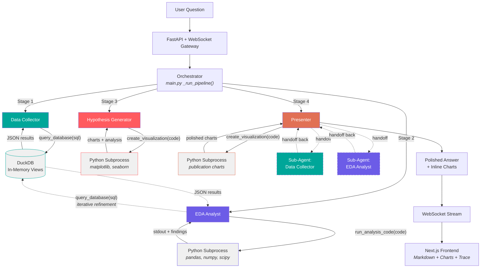
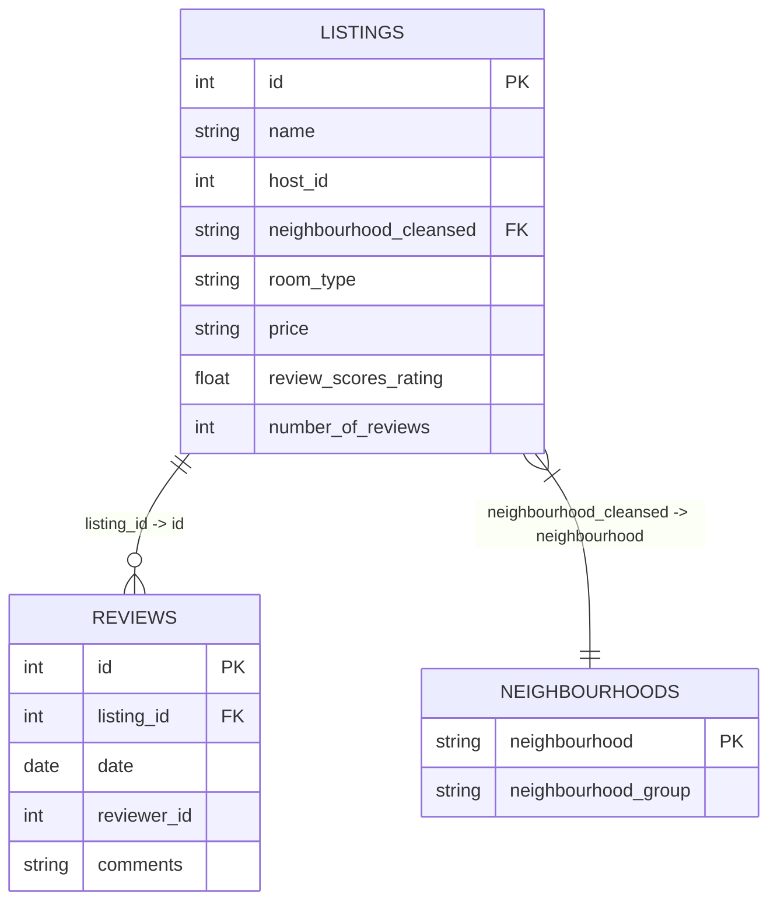
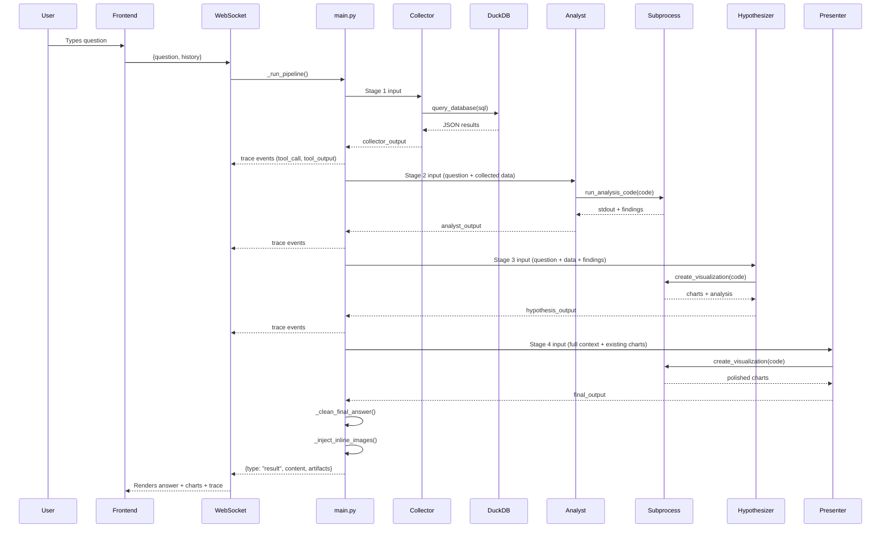
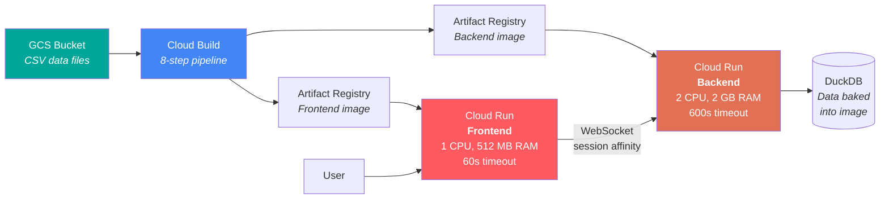

# NYC Airbnb Multi-Agent Data Analyst

> Ask a plain-English question about New York City's Airbnb market and get back a polished analytical briefing with charts -- fully autonomous, no human in the loop.

**Live demo:** [airbnb-frontend-686529012610.us-east1.run.app](https://airbnb-frontend-686529012610.us-east1.run.app) | **API:** [airbnb-backend-686529012610.us-east1.run.app](https://airbnb-backend-686529012610.us-east1.run.app)

A four-stage agent pipeline (Collect -> Analyze -> Hypothesize -> Present) runs over 37K Airbnb listings, 985K reviews, and 230 neighbourhood mappings from [Inside Airbnb](http://insideairbnb.com/). Each agent writes and executes its own SQL/Python at runtime. The frontend streams every agent action over WebSocket so you can watch the pipeline think. Typical end-to-end latency is 40-60 seconds on Gemini 3.1 Flash Lite via Google Vertex AI.

Arjun Varma & Oranich Jamkachornkiat -- Columbia University, Agentic AI, Spring 2026

---

## Architecture

Five agents, orchestrated by procedural Python (not an LLM router), built on the **OpenAI Agents SDK**:

| Stage | Agent | Tools | Job |
|-------|-------|-------|-----|
| 1 | Data Collector | `query_database` (DuckDB SQL) | Translate the question into SQL, return structured results |
| 2 | EDA Analyst | `run_analysis_code` + `query_database` | Compute statistics in Python; query the DB again when gaps appear (iterative refinement) |
| 3 | Hypothesis Generator | `create_visualization` | Form data-grounded conclusions with supporting charts |
| 4 | Presenter | `create_visualization` + sub-agent handoffs | Produce a polished briefing with publication-quality charts |

The Presenter can delegate to two sub-agents (a Collector and an Analyst) via SDK handoffs for additional data, making it the only agent with a refinement loop.



---

## Dataset

Three CSV files from [Inside Airbnb](http://insideairbnb.com/) (NYC, 2022), loaded into DuckDB at startup:

- **listings** -- 37,257 rows, 71 columns (85 MB): host info, property details, geolocation, pricing, availability, 7 review-score dimensions
- **reviews** -- 985,674 rows, 6 columns (295 MB): guest comments with dates and reviewer IDs
- **neighbourhoods** -- 230 rows mapping neighbourhood names to the five boroughs



The dataset has real-world quirks baked into every agent's prompt: `price` is a VARCHAR (`"$150.00"`), booleans are `'t'`/`'f'` strings, rates are percentage strings (`"95%"`), and `amenities` is a JSON array stored as plain text.

---

## Pipeline Detail



**Context threading.** Each stage's output is fed forward to the next via explicit builder functions. For follow-up questions, the frontend sends conversation history and the backend resolves references ("same", "that", "those") before starting a fresh pipeline run.

**Code execution.** Agent-written Python runs in a subprocess with a 120s timeout. An import whitelist restricts modules to pandas, numpy, scipy, matplotlib, seaborn, duckdb, and a few stdlib modules. A postamble auto-saves any open matplotlib figures. Artifacts are persisted to `/artifacts/{run_id}/` and served as static files.

**Reliability.** 180s per-stage timeout, 600s pipeline timeout, PNG magic-byte validation, blank-chart filtering (< 5 KB), duplicate chart deduplication, hard cap of 4 charts per answer, and a retry with nudge if the Presenter produces zero charts.

---

## Frontend

Next.js 16 / React 19 / TypeScript / Tailwind CSS 4. Communicates via WebSocket (analysis) and REST (schema, sharing).

Features: real-time pipeline progress flowchart, expandable thinking trace showing every SQL query and Python block, inline chart rendering, interactive schema explorer, shareable result URLs (`/share/[id]`), and a memory card game to pass the time during pipeline execution.

---

## Deployment

Two Google Cloud Run services in `us-east1`, deployed via an 8-step Cloud Build pipeline (`cloudbuild.yaml`):



Data is baked into the backend Docker image at build time -- the running container needs no external data access. Both services scale 0-3 instances.

---

## Model Configuration

- **Default model:** `google/gemini-3.1-flash-lite-preview` via Google Vertex AI (configurable via `AGENT_MODEL` env var)
- **Provider:** Google Vertex AI -- uses Application Default Credentials (`gcloud auth application-default login`), requires `GCP_PROJECT_ID` env var
- **Prompts:** Dedicated markdown files in `backend/prompts/`, with `{SCHEMA_INFO}` placeholders replaced at startup from live DuckDB metadata
- **Evaluation:** `backend/evaluate.py` benchmarks the pipeline against a 20-question suite across configurable Vertex AI models, scoring on success, charts, depth, efficiency, and speed

---

## Requirements

### Backend (`backend/pyproject.toml`)

```
openai-agents>=0.7.0        # Agent framework
openai>=1.0.0               # Vertex AI OpenAI-compatible client
google-auth>=2.29.0         # GCP credential management
fastapi>=0.115.0            # REST + WebSocket API
uvicorn[standard]>=0.34.0   # ASGI server
duckdb>=1.2.0               # In-process OLAP engine
pandas>=2.2.0               # DataFrame manipulation
numpy>=1.26.0               # Numerical computation
scipy>=1.14.0               # Statistical tests
matplotlib>=3.9.0           # Chart generation
seaborn>=0.13.0             # Statistical visualization
pydantic>=2.10.0            # Structured schemas
python-dotenv>=1.0.0        # Env var management
```

### Frontend

Next.js 16.2.2, React 19.2.4, TypeScript 5, Tailwind CSS 4, react-markdown 10.1.0, remark-gfm 4.0.1.

---

## Grading Rubric Mapping

### Core Requirements (10 points)

| Requirement | Implementation | Key Files |
|-------------|----------------|-----------|
| **Frontend** (2 pts) | Next.js 16 / React 19 with real-time WebSocket streaming, markdown + inline charts, schema explorer, pipeline flowchart, agent trace, shareable results | `frontend/src/app/page.tsx`, `frontend/src/components/*.tsx` |
| **Agent Framework** (1 pt) | OpenAI Agents SDK -- `Agent`, `function_tool`, `Runner.run_streamed()`, `handoffs` | `backend/agent_defs/*.py` |
| **Tool Calling** (1 pt) | 3 tools: `query_database` (SQL), `run_analysis_code` (Python), `create_visualization` (charts) | `backend/tools/sql_runner.py`, `backend/tools/code_executor.py` |
| **Non-Trivial Dataset** (1 pt) | 37K listings (71 cols, 85 MB) + 985K reviews (295 MB) + 230 neighbourhoods | `Sample Data/*.csv` |
| **Multi-Agent Pattern** (2 pts) | 5 agents with distinct prompts; Presenter has 2 sub-agents with bidirectional handoffs | `backend/pipeline.py`, `backend/main.py` |
| **Deployed** (2 pts) | Docker on GCP Cloud Run, Cloud Build CI/CD | `cloudbuild.yaml`, `backend/Dockerfile`, `frontend/Dockerfile` |
| **README** (1 pt) | This document | `README.md` |

### Elective Features (5 points)

| Feature | Implementation | Key Files |
|---------|----------------|-----------|
| **Code Execution** (2.5 pts) | Agents write Python at runtime, executed in subprocess with timeout, import whitelist, artifact validation | `backend/tools/code_executor.py` |
| **Data Visualization** (2.5 pts) | Hypothesis charts + Presenter publication-quality charts with Airbnb palette and insight-driven titles | `backend/agent_defs/hypothesizer.py`, `presenter.py` |
| **Artifacts** (bonus) | PNGs saved to `/artifacts/{run_id}/`, served as static files, embedded inline, persisted for sharing | `backend/tools/code_executor.py`, `backend/main.py` |
| **Structured Output** (bonus) | Pydantic models for tool payloads; JSON outputs with `columns`, `row_count`, `exit_code`, `artifacts` | `backend/models/schemas.py` |
| **Iterative Refinement** (2.5 pts) | EDA Analyst has both `run_analysis_code` and `query_database` -- queries the DB when analysis reveals gaps | `backend/agent_defs/analyst.py`, `backend/prompts/analyst.md` |

---

## Evaluation

Validated against 20 analytical questions (pricing, hosts, text analysis, geography, amenities, availability, quality, trends) with **100% success rate** and an average quality score of **91/100** on Gemini 3.1 Flash Lite. The evaluation harness (`backend/evaluate.py`) collects per-stage metrics and scores on five dimensions: success, chart quantity, answer depth, tool-call efficiency, and speed.

---

Arjun Varma & Oranich Jamkachornkiat | Columbia University -- Agentic AI, Spring 2026

Data source: [Inside Airbnb](http://insideairbnb.com/) (NYC, 2022). Built with the [OpenAI Agents SDK](https://github.com/openai/openai-agents-python), [Google Vertex AI](https://cloud.google.com/vertex-ai), [DuckDB](https://duckdb.org/), [FastAPI](https://fastapi.tiangolo.com/), [Next.js](https://nextjs.org/), and [Google Cloud Run](https://cloud.google.com/run).
