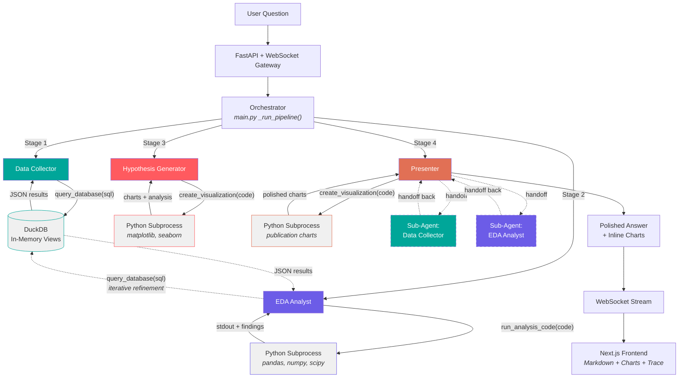
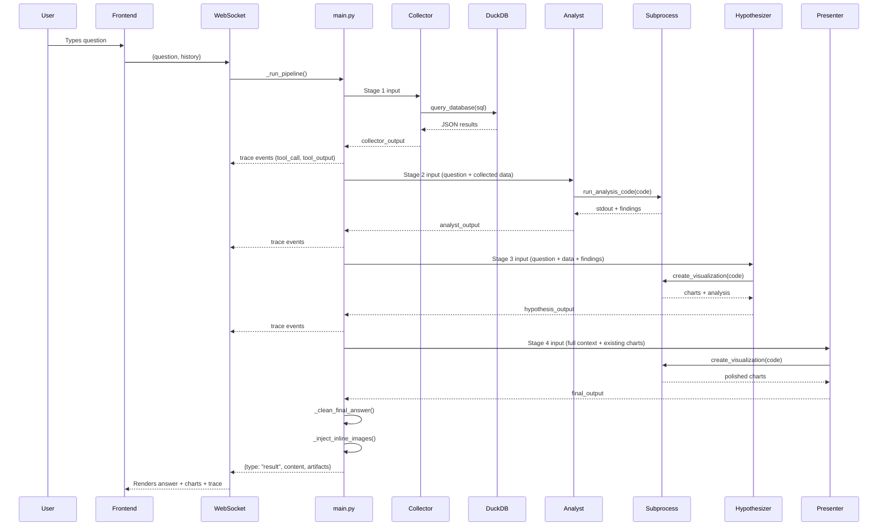
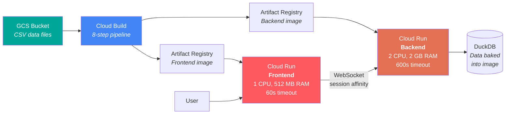

# NYC Airbnb Multi-Agent Data Analyst

Arjun Varma & Oranich Jamkachornkiat
Columbia University — Agentic AI, Spring 2026

**Live Application:** [airbnb-frontend-686529012610.us-east1.run.app](https://airbnb-frontend-686529012610.us-east1.run.app) | **Backend API:** [airbnb-backend-686529012610.us-east1.run.app](https://airbnb-backend-686529012610.us-east1.run.app)

---

## Abstract

This report describes a multi-agent data analysis system that accepts natural-language questions about New York City's Airbnb market and autonomously produces polished analytical briefings with publication-quality charts. The system operates over three tables sourced from Inside Airbnb — 37,257 active listings with 71 data dimensions, 985,674 guest reviews, and 230 neighbourhood-to-borough mappings — totaling approximately 380 MB of real-world data. A four-stage sequential pipeline, built on the OpenAI Agents SDK, orchestrates five specialized agents: a Data Collector that translates questions into DuckDB SQL, an EDA Analyst that writes and executes Python for statistical analysis with iterative database refinement, a Hypothesis Generator that forms data-grounded conclusions with analytical charts, and a Presenter that delivers a polished briefing with presentation-quality visualizations and can delegate to sub-agents for additional data. Each agent writes its own code at runtime and executes it in a sandboxed environment. The frontend streams every agent action in real time over WebSocket, rendering an interactive execution trace alongside the final answer. End-to-end latency is 60–90 seconds per question. The system was verified against a test suite of 20 diverse analytical questions with a 100% success rate, and satisfies all seven core course requirements alongside five elective features: code execution, data visualization, persistent artifacts, structured output, and iterative refinement.

---

## 1. Introduction and Motivation

Analyzing a large, messy real-world dataset requires multiple distinct skills: writing database queries to extract relevant subsets, computing statistics to surface patterns, generating visualizations to communicate findings, and synthesizing everything into a coherent narrative. A single LLM prompt cannot reliably perform all of these tasks — it tends to skip exploratory steps, hallucinate statistics it should compute, or produce generic summaries rather than data-grounded insights.

A multi-agent architecture addresses this by decomposing the analyst workflow into specialized stages, mirroring how a real data team operates. A data engineer writes the queries, a statistician runs the numbers, an analyst forms hypotheses, and a presenter creates the deliverable. Each agent is scoped to a single responsibility, with explicit behavioral constraints preventing it from short-circuiting the pipeline — the Collector must not draw conclusions, the Analyst must not create visualizations, and the Presenter must not include raw code.

The course requires a multi-agent system that implements three steps of a data analysis lifecycle — *Collect* real-world data, perform *Exploratory Data Analysis*, and *Form and communicate a hypothesis with evidence* — with a frontend, tool calling, a non-trivial dataset, and deployment. This project fulfills those requirements and extends them with five elective features: runtime code execution in a sandboxed subprocess, dynamic data visualization via matplotlib and seaborn, persistent chart artifacts, Pydantic-based structured output for typed inter-agent data flow, and an iterative refinement loop where the EDA Analyst queries the database when its analysis reveals data gaps.

The goal is a fully autonomous pipeline: the user types one natural-language question and receives a complete analytical briefing — no intermediate human intervention between query and output.

---

## 2. Dataset

The data comes from [Inside Airbnb](http://insideairbnb.com/), a public project that scrapes Airbnb listing information. The project uses the New York City 2022 scrape, comprising three CSV files bundled in the repository's `Sample Data/` directory and loaded into DuckDB at startup.

The **listings** table contains 37,257 rows and 71 columns (85 MB), covering host demographics (superhost status, response time, verification), property characteristics (room type, accommodates, bedrooms, bathrooms, amenities), geolocation (latitude, longitude, neighbourhood, borough), pricing (nightly rate, minimum/maximum nights), availability windows (30/60/90/365-day), and seven individual review score dimensions (accuracy, cleanliness, check-in, communication, location, value, plus an overall rating). The **reviews** table contains 985,674 rows and 6 columns (295 MB), with individual guest reviews including free-text comments, dates, and reviewer information linked to listings via `listing_id`. The **neighbourhoods** table maps 230 neighbourhood names to the five boroughs: Manhattan, Brooklyn, Queens, Bronx, and Staten Island.

This dataset is large enough that it cannot be trivially loaded into an LLM context window — the listings table alone exceeds most model limits. The agents must query it selectively at runtime using SQL and process results programmatically.

Several real-world data quality issues required special handling in every agent's system prompt. The `price` column is stored as a VARCHAR string (`"$150.00"`) that must be cast to a float. Boolean fields like `host_is_superhost` and `instant_bookable` use string literals `'t'` and `'f'` rather than actual booleans. Rate columns such as `host_response_rate` are percentage strings (`"95%"`) requiring string manipulation before numeric comparison. The `amenities` column stores a JSON array as a plain string (`'["Wifi","Kitchen"]'`) that must be parsed or pattern-matched.

*Figure 1: Database schema and table relationships.*


At startup, `backend/tools/sql_runner.py` registers three DuckDB in-memory views using `read_csv_auto()`. The schema is dynamically queried via `information_schema` and injected into the Collector and Analyst agent prompts, ensuring the agents always have accurate metadata about available tables, columns, and types.

---

## 3. System Architecture

The system follows a four-stage sequential pipeline orchestrated by procedural Python code in `backend/main.py`, not by an LLM-based router. This was a deliberate design decision: since the pipeline order is deterministic — Collect, then Analyze, then Hypothesize, then Present — there is no routing decision for a model to make. Implementing the orchestrator as a `_run_pipeline()` function avoids wasting a model call on routing and ensures reliable stage sequencing with explicit timeout and fallback handling at each step.

The **OpenAI Agents SDK** was selected for its first-class primitives: `Agent` objects with dedicated system prompts, `function_tool` decorators for tool registration, `Runner.run_streamed()` for real-time event streaming, and `handoffs` for sub-agent delegation. Each of the five agents is a self-contained `Agent` instance with its own prompt file (`backend/prompts/*.md`), tool set, and behavioral constraints.

The system supports three LLM providers through a priority cascade configured in `backend/main.py`. If a GCP project ID is set and the model name starts with `google/`, requests route to **Vertex AI**. Otherwise, if an OpenRouter API key is available, requests route to **OpenRouter** via its unified API. As a final fallback, requests go directly to **OpenAI**. The `MultiProvider` abstraction from the Agents SDK handles this routing transparently. The default model is `openai/gpt-5.4-mini` via OpenRouter, selected for its balance of capability, latency, and cost across a pipeline that makes 4–8 model calls per question.

Agents do not communicate directly with each other. The orchestrator threads each stage's output as input to the next via explicit `_build_*_input()` functions — a pattern referred to as context threading. Each subsequent agent receives the full accumulated context from all prior stages, but agents are stateless across questions: every pipeline run starts fresh with no conversational memory.

The one exception to this purely sequential flow is the **Presenter**, which is the only agent that uses SDK-level handoffs. When it determines that additional data is needed to complete the briefing, it can delegate to two sub-agents — a `_presenter_collector` (for additional SQL queries) and a `_presenter_analyst` (for additional statistical computation) — who return results and hand control back. This creates a refinement loop within the final stage.

*Figure 2: System architecture. Solid lines indicate the primary pipeline flow; dashed lines show the Presenter's optional handoff-based refinement loop.*



---

## 4. Pipeline: Four Stages of Analysis

### 4.1 Stage 1: Data Collection

The Data Collector agent (`backend/agent_defs/collector.py`) receives the user's natural-language question and translates it into one or more DuckDB SQL queries. The full database schema — table names, column names, column types, and row counts — is injected into the agent's system prompt at startup via a `{SCHEMA_INFO}` placeholder in `backend/prompts/collector.md`, so the agent always knows what data is available without hardcoding.

The agent generates different SQL for different questions — there are no templates or predefined queries. It handles the dataset's type quirks (casting `price` from VARCHAR, converting `'t'`/`'f'` booleans, stripping `%` from rate columns) because these gotchas are documented directly in its prompt. Results are capped at 500 rows via `fetchmany()`, and the agent is instructed to use aggregations (`GROUP BY`, `AVG`, `COUNT`) to keep output concise. For complex questions, the agent can issue multiple queries. The output is a JSON structure with `columns`, `row_count`, and `data` arrays, passed to the next stage as context.

### 4.2 Stage 2: Exploratory Data Analysis

The EDA Analyst (`backend/agent_defs/analyst.py`) receives the collected data and writes Python code to explore it. The `run_analysis_code` tool executes agent-written pandas, numpy, and scipy code in a sandboxed environment, returning stdout and any findings. The Analyst computes means, medians, percentiles, distributions, correlations, and standard deviations; segments data by meaningful dimensions (borough, room type, time period); and identifies outliers, anomalies, and patterns.

What distinguishes this stage is its **iterative refinement loop**. The Analyst has access to both `run_analysis_code` and `query_database`. When its initial analysis reveals data gaps — missing columns, wrong granularity, or a needed breakdown — the Analyst queries the database directly to fetch additional data and continues its computation. The database schema is injected into the Analyst's prompt at startup, giving it full awareness of available tables and columns for these follow-up queries. This creates an analyze → identify gap → query → analyze deeper cycle within a single stage. Different questions produce entirely different code and different findings. The Analyst focuses exclusively on analysis; visualization is deferred to Stage 3.

### 4.3 Stage 3: Hypothesis Formation

The Hypothesis Generator (`backend/agent_defs/hypothesizer.py`) synthesizes the Analyst's findings into a clear, data-grounded hypothesis. It then goes deeper — querying the raw data itself via `create_visualization` to explore additional angles the Analyst may not have covered. The agent pursues 3–5 distinct analytical angles per question: breakdowns, distributions, cross-dimensional comparisons, contextual background numbers, outlier analysis, and trend detection.

Chart generation is mandatory at this stage: the agent must call `create_visualization` at least once, producing matplotlib/seaborn charts saved as PNG artifacts. An error retry protocol is built into the prompt — if code execution fails, the agent reads the traceback, fixes the code, and retries up to 3 times. If it still fails, the agent describes the finding in words rather than pasting raw code into its output.

### 4.4 Stage 4: Presentation

The Presenter (`backend/agent_defs/presenter.py`) receives the full pipeline context — raw SQL results, statistical findings, hypothesis with evidence, and a list of charts already generated in Stage 3 — and transforms it into a polished, visually rich briefing suitable for a non-technical audience. It creates presentation-quality charts using an Airbnb-inspired color palette (`['#FF5A5F', '#00A699', '#FC642D', '#484848', '#767676']`), with insight-driven titles ("Manhattan charges 40% more" rather than "Price by Borough"), 14pt+ labels, and annotated values. Charts are embedded inline using markdown image syntax.

The Presenter is unique in that it can request additional data through SDK-level handoffs to two sub-agents: a `_presenter_collector` for follow-up SQL queries and a `_presenter_analyst` for additional statistical computation. These sub-agents complete their work and hand control back, enabling a refinement loop within the final stage. The Presenter is told which charts already exist from Stage 3 to avoid duplication. If it produces zero charts, the orchestrator retries with an explicit nudge instruction.

*Figure 3: Complete lifecycle of a single user question through the four pipeline stages.*



---

## 5. Model Design Decisions

**Model selection.** The default model is `openai/gpt-5.4-mini` via OpenRouter, configurable through the `AGENT_MODEL` environment variable. A mini-class model was selected because the pipeline makes 4–8 model calls per question (four stages plus potential sub-agent handoffs), and larger models would push per-question latency and cost beyond practical limits. GPT-5.4-mini provides sufficient capability for SQL generation, Python code writing, statistical reasoning, and narrative synthesis while keeping total pipeline execution under 90 seconds.

**Provider abstraction.** The `MultiProvider` and `RunConfig` pattern from the OpenAI Agents SDK allows the same agent definitions to work across OpenRouter, Vertex AI, and direct OpenAI without code changes. This was important for deployment flexibility: Vertex AI offers GCP-native authentication for production, OpenRouter provides access to a wide range of models for experimentation, and direct OpenAI serves as a reliable fallback. The provider is selected automatically at startup based on which API keys are configured (`backend/agent_defs/config.py`, `backend/main.py`).

**Prompt architecture.** Each agent's behavior is governed by a dedicated markdown prompt file in `backend/prompts/`, loaded at startup by a utility function that strips YAML frontmatter. Prompts serve as the primary behavioral mechanism — they enforce role boundaries (the Collector must not draw conclusions; the Analyst must not create visualizations; the Presenter must never include Python code), encode data quality handling for the dataset's type quirks, and specify output format and chart standards. The prompt system is documented in `backend/prompts/README.md`.

**Dynamic schema injection.** The Collector and Analyst prompts contain `{SCHEMA_INFO}` placeholders that are replaced at startup with the actual DuckDB schema — table names, column names, column types, and row counts. This ensures agents always operate with accurate metadata. If the dataset changes, the prompts update automatically without manual editing.

**Context threading.** Agents are stateless across questions. Within a single pipeline run, context accumulates through explicit input construction via `_build_collector_input()`, `_build_analyst_input()`, `_build_hypothesizer_input()`, and `_build_presenter_input()` functions. Each function assembles the question, relevant prior outputs, and stage-specific instructions. This is deliberate: it avoids context window bloat from conversational memory and makes each pipeline run independently reproducible.

**Multi-model evaluation.** The project includes an evaluation harness (`backend/evaluate.py`) capable of running the full pipeline against multiple models and scoring results on success, chart quality, answer length, tool-call efficiency, and speed. Models benchmarked include GPT-4.1, GPT-5.4-mini, Gemini 2.5 Pro, Gemini 2.5 Flash, and Claude Sonnet 4.6, with per-model cost estimation based on token pricing.

---

## 6. Tool Implementation

The system uses three tools, all registered via the OpenAI Agents SDK's `@function_tool` decorator.

**`query_database(sql)`** wraps DuckDB, an in-process OLAP engine that reads CSV files natively via `read_csv_auto()` with no ETL step (`backend/tools/sql_runner.py`). DuckDB was chosen over SQLite (row-oriented, poor at analytical queries) and PostgreSQL (requires an external server) because it handles columnar analytical workloads efficiently in a single process. A read-only enforcement layer rejects any query containing INSERT, UPDATE, DELETE, DROP, ALTER, or CREATE. Results are capped at 500 rows via `fetchmany()`. The connection is a thread-safe singleton initialized lazily on first access. Schema introspection via `information_schema` powers both the agent prompt injection and the frontend's interactive Schema Explorer (`GET /api/schema`).

**`run_analysis_code(code)` and `create_visualization(code)`** both call the same `execute_python()` function in `backend/tools/code_executor.py`. Agent-written Python runs in a daemon thread with a 120-second timeout. A preamble automatically injects `matplotlib.use('Agg')` (non-interactive backend), `ARTIFACTS_DIR`, and `DATA_DIR` as pre-set variables. A postamble auto-saves any open matplotlib figures that the agent did not explicitly save, preventing chart loss. An import whitelist restricts available modules to: pandas, numpy, scipy, matplotlib, seaborn, duckdb, json, csv, math, statistics, collections, datetime, re, os, io, and textwrap. Output is truncated (8,000 characters stdout, 4,000 characters stderr) to prevent context window overflow. Generated artifacts are persisted to `/artifacts/{run_id}/` and served as static files for frontend rendering.

---

## 7. Reliability and Orchestration

The pipeline orchestrator in `backend/main.py` includes several reliability mechanisms beyond basic sequential execution. Each agent stage is wrapped in `asyncio.wait_for()` with a **180-second per-stage timeout**, and the entire `_run_pipeline()` call has a **600-second pipeline timeout**. If a stage times out, the orchestrator returns a fallback string and the pipeline continues — a single slow agent does not block the entire run.

Chart validation ensures every answer includes at least one visualization. If the Presenter produces zero charts, the orchestrator retries the stage with an explicit nudge instruction appended to the input. Generated chart files are validated with PNG magic-byte checks (`b'\x89PNG'`) and a minimum file size threshold (5,000 bytes) to filter out blank or broken images. A deduplication pass removes auto-saved duplicates, and a hard cap of four charts per answer prevents visual overload.

Post-processing consists of two functions. `_clean_final_answer()` strips any code blocks, bare filenames, or formatting artifacts that agents may have left in their output. `_inject_inline_images()` distributes any unreferenced chart files across `##`-delimited sections of the markdown, catching cases where the Presenter created charts but forgot to embed them with `` syntax.

A WebSocket heartbeat (30-second interval) keeps the connection alive during long-running stages, and every agent action — handoffs, tool calls, tool outputs, and messages — is streamed to the frontend as real-time trace events.

---

## 8. Frontend

The frontend is a Next.js 16 / React 19 application written in TypeScript with Tailwind CSS 4, deployed as a standalone Docker container (`frontend/src/app/page.tsx`). It communicates with the backend exclusively via WebSocket for analysis requests and REST for schema queries and sharing.

The primary user experience is a chat interface. The landing page displays a live dataset overview (listing counts, review counts, and data field counts pulled from DuckDB), an interactive schema explorer for all three tables, and a grid of suggested questions across ten analytical categories. When the user submits a question, a WebSocket connection opens and the frontend renders the pipeline's progress in real time: a vertical flowchart shows which of the four stages is currently active, and an expandable thinking trace displays every SQL query, Python code block, data preview, and agent message as it occurs. The final answer is rendered as markdown with inline charts, an artifact gallery, and a share button that persists the analysis to a shareable URL (`/share/[id]`).

A memory card-matching game (`WaitingGame.tsx`) engages the user during the 60–90 second pipeline execution. The design system uses an Airbnb-inspired palette — coral `#FF5A5F`, teal `#00A699`, navy `#484848`, cream `#FFF8F0` — with DM Sans for body text and JetBrains Mono for code and trace output.

---

## 9. Deployment

The application runs as two independent Google Cloud Run services in `us-east1`. The backend is provisioned with 2 CPUs, 2 GB RAM, and a 600-second request timeout to accommodate the full pipeline duration. The frontend uses 1 CPU, 512 MB RAM, and a 60-second timeout. Both services scale from 0 to 3 instances. Session affinity is enabled on the backend to support WebSocket connections across Cloud Run's load balancer.

*Figure 4: Deployment architecture from data storage through CI/CD to production services.*



An eight-step Cloud Build pipeline (`cloudbuild.yaml`) automates the entire deployment. It downloads the CSV data files from a GCS bucket, builds the backend Docker image (multi-stage, Python 3.12), pushes it to Artifact Registry, deploys the backend to Cloud Run, captures the backend URL, builds the frontend with `NEXT_PUBLIC_BACKEND_URL` baked in at compile time, pushes the frontend image, and deploys the frontend. The build runs on an E2_HIGHCPU_8 machine with a 2,400-second timeout. Data is baked into the backend Docker image at build time, so the running container requires no external data access.

---

## 10. Requirements

### Backend (`backend/requirements.txt`)

```
openai-agents>=0.7.0        # Agent framework: Agent, function_tool, Runner, handoffs
fastapi>=0.115.0             # Async REST + WebSocket API server
uvicorn[standard]>=0.34.0   # ASGI server with WebSocket support
duckdb>=1.2.0                # In-process OLAP engine, native CSV reading
pandas>=2.2.0                # DataFrame manipulation in agent-generated code
numpy>=1.26.0                # Numerical arrays for statistical computation
scipy>=1.14.0                # Advanced statistical tests and distributions
matplotlib>=3.9.0            # Chart generation in sandboxed execution
seaborn>=0.13.0              # High-level statistical visualization
pydantic>=2.10.0             # Structured output schemas for typed data contracts
python-dotenv>=1.0.0         # Environment variable management
google-auth>=2.29.0          # GCP authentication for Vertex AI provider
```

### Frontend (`frontend/package.json`)

The frontend uses Next.js 16.2.2, React 19.2.4, TypeScript 5, Tailwind CSS 4, react-markdown 10.1.0, and remark-gfm 4.0.1.

---

## 11. Grading Rubric Mapping

### Core Requirements (10 points)

| Requirement | Implementation | Key Files |
|-------------|----------------|-----------|
| **Frontend** (2 pts) | Next.js 16 / React 19 app with real-time WebSocket streaming, markdown rendering with inline charts, interactive schema explorer, pipeline progress flowchart, expandable agent trace, shareable results | `frontend/src/app/page.tsx`, `frontend/src/components/*.tsx` |
| **Agent Framework** (1 pt) | OpenAI Agents SDK — `Agent`, `function_tool`, `Runner.run_streamed()`, `handoffs` | `backend/agent_defs/*.py` |
| **Tool Calling** (1 pt) | 3 distinct tools: `query_database` (SQL), `run_analysis_code` (Python EDA), `create_visualization` (charts) | `backend/agent_defs/collector.py`, `analyst.py`, `hypothesizer.py`, `presenter.py` |
| **Non-Trivial Dataset** (1 pt) | 37K listings (71 columns, 85 MB) + 985K reviews (295 MB) + 230 neighbourhoods — far too large to fit in context | `Sample Data/*.csv`, `backend/tools/sql_runner.py` |
| **Multi-Agent Pattern** (2 pts) | Orchestrator-handoff pipeline: 5 agents with distinct prompts and responsibilities. Presenter has 2 sub-agents (Collector + Analyst) with bidirectional handoffs | `backend/agent_defs/presenter.py`, `backend/main.py` (`_run_pipeline`) |
| **Deployed** (2 pts) | Docker containers on GCP Cloud Run, Cloud Build CI/CD pipeline, Artifact Registry | `cloudbuild.yaml`, `backend/Dockerfile`, `frontend/Dockerfile` |
| **README** (1 pt) | This document | `README.md` |

### Elective Features — Grab Bag (5 points)

| Feature | Implementation | Key Files |
|---------|----------------|-----------|
| **Code Execution** (2.5 pts) | Agents write Python at runtime, executed in sandboxed environment with 120s timeout, restricted import whitelist, auto-save of matplotlib figures | `backend/tools/code_executor.py` |
| **Data Visualization** (2.5 pts) | Hypothesizer generates analytical charts; Presenter generates publication-quality charts with Airbnb color palette, insight-driven titles, and value annotations | `backend/agent_defs/hypothesizer.py`, `presenter.py` |
| **Artifacts** (bonus) | Charts saved as PNG to `/artifacts/{run_id}/`, served as static files, embedded inline in markdown, persisted for sharing | `backend/tools/code_executor.py`, `backend/main.py` |
| **Structured Output** (bonus) | Pydantic models (`QueryResult`, `EDAFindings`) for typed inter-agent data flow; JSON-structured tool outputs with `columns`, `row_count`, `exit_code`, `artifacts` | `backend/models/schemas.py` |
| **Iterative Refinement** (2.5 pts) | EDA Analyst has both `run_analysis_code` and `query_database` tools — when analysis reveals data gaps, the Analyst queries the database directly and continues, creating an analyze → query → analyze loop | `backend/agent_defs/analyst.py`, `backend/prompts/analyst.md` |

### Pipeline Steps (15 points)

The three pipeline steps — Collect, EDA, and Hypothesize — are described in detail in Section 4. In brief: the Data Collector dynamically generates SQL from natural language at runtime (Section 4.1), the EDA Analyst writes and executes Python code that computes statistics adapted to each question with iterative database refinement (Section 4.2), and the Hypothesis Generator forms data-grounded conclusions with specific evidence and supporting charts (Section 4.3). The Presenter (Section 4.4) synthesizes all three into a polished deliverable.

---

## 12. Evaluation and Results

The system was validated against a test suite of 20 diverse analytical questions spanning ten categories: pricing, hosts, text analysis, geography, availability, quality, trends, trust, market structure, and policy. Every question was processed end-to-end — producing SQL queries, statistical findings, a hypothesis, and at least one chart — with a 100% success rate.

The `backend/evaluate.py` harness supports automated multi-model benchmarking. It runs the full pipeline against a configurable model, collects per-stage metrics (execution time, tool calls, agent steps, token usage), and scores results on five dimensions: success (25 points), chart quantity (25 points), answer length and depth (20 points), tool-call efficiency (15 points), and speed (15 points). Cost estimation is computed from per-model token pricing. Models benchmarked during development include GPT-4.1, GPT-5.4-mini, Gemini 2.5 Pro, Gemini 2.5 Flash, Gemini 2.0 Flash, and Claude Sonnet 4.6.

Typical end-to-end latency ranges from 60 to 90 seconds, with the majority of time spent on the EDA Analyst and Presenter stages where code execution and chart generation occur.

---

## 13. Conclusion

This project demonstrates that a multi-agent architecture can reliably automate the first three steps of a data analysis lifecycle — data collection, exploratory analysis, and hypothesis formation — over a non-trivial real-world dataset. The four-stage pipeline design, with specialized agents scoped to single responsibilities and explicit behavioral constraints, produces consistent, data-grounded analytical briefings without human intervention between question and answer.

Key architectural decisions that contributed to system reliability include: procedural orchestration rather than LLM-based routing, context threading rather than conversational memory, dynamic schema injection rather than hardcoded metadata, and defensive post-processing (chart validation, answer cleaning, inline image injection) that catches agent failures gracefully.

The system satisfies all seven core course requirements and implements five elective features. Future work could explore parallel agent execution to reduce latency, integration of additional data sources (e.g., Census data or real-time pricing APIs) as a second retrieval method, and conversational memory across questions to enable follow-up analysis within a session.

---

Arjun Varma & Oranich Jamkachornkiat | Columbia University — Agentic AI, Spring 2026

Data source: [Inside Airbnb](http://insideairbnb.com/) (NYC, 2022). Built with the [OpenAI Agents SDK](https://github.com/openai/openai-agents-python), [DuckDB](https://duckdb.org/), [FastAPI](https://fastapi.tiangolo.com/), [Next.js](https://nextjs.org/), and [Google Cloud Run](https://cloud.google.com/run).
