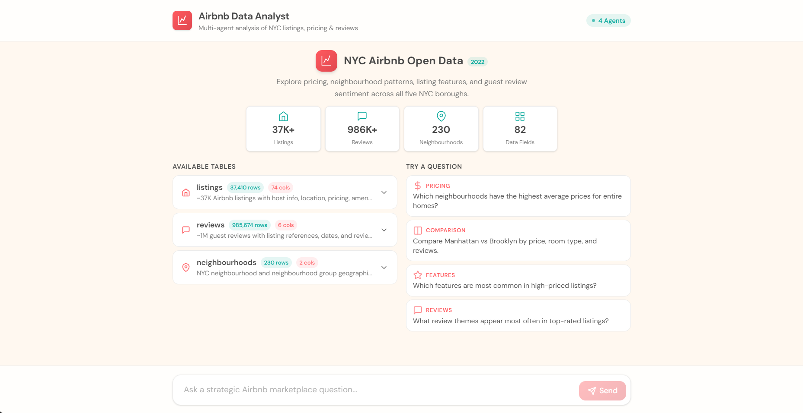
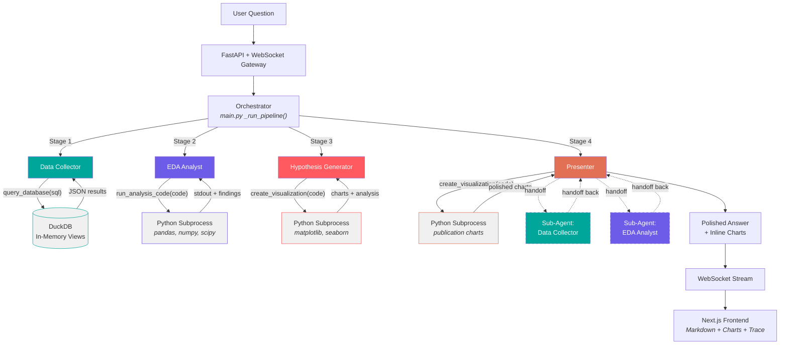
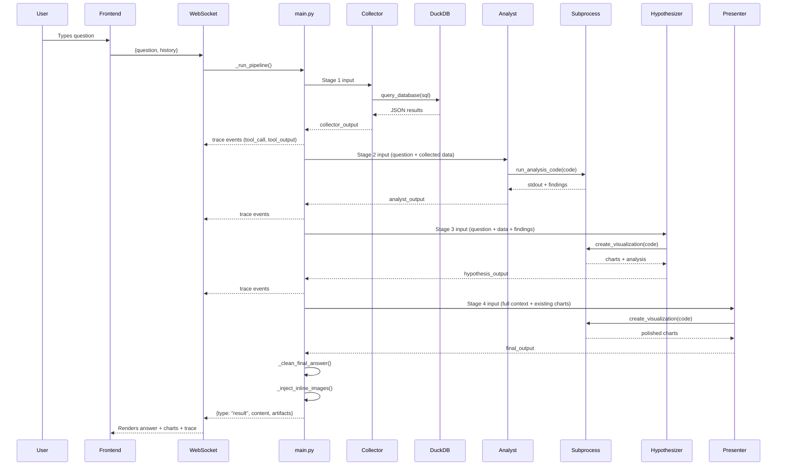
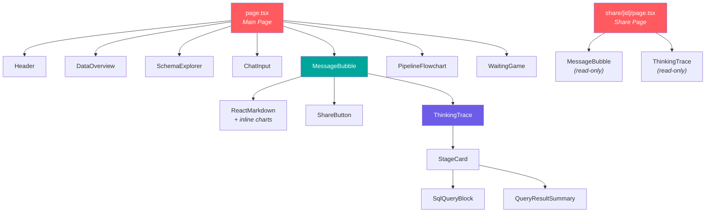
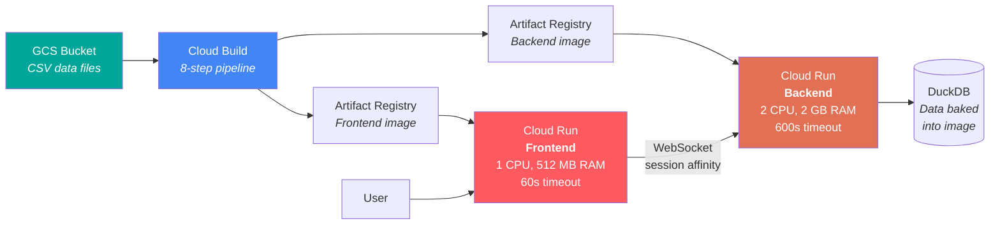

# NYC Airbnb Multi-Agent Data Analyst

> Autonomous data analysis pipeline that turns natural-language questions about NYC Airbnb data into polished, insight-driven reports with presentation-quality charts.

**Live Demo:** [airbnb-frontend-686529012610.us-east1.run.app](https://airbnb-frontend-686529012610.us-east1.run.app) | **Backend API:** [airbnb-backend-686529012610.us-east1.run.app](https://airbnb-backend-686529012610.us-east1.run.app)

**Stack:** Python 3.12 | OpenAI Agents SDK | FastAPI | DuckDB | Next.js 16 | React 19 | Tailwind CSS 4 | Google Cloud Run

Arjun Varma & Oranich Jamkachornkiat | Columbia University | Agentic AI, Spring 2026

---

## Executive Summary

**Situation.** New York City's short-term rental market spans **37,257 active Airbnb listings** across five boroughs, backed by **985,674 guest reviews** and **71 data dimensions** covering host profiles, property details, pricing, availability, amenities, and review scores. Answering analytical questions about this dataset requires a data analyst to write SQL queries, clean messy column types, compute statistics, generate charts, and synthesize findings into a coherent narrative. The Agentic AI course requires a multi-agent system that performs three steps of a data analysis lifecycle: *Collect* real-world data, perform *Exploratory Data Analysis*, and *Form and communicate a hypothesis with evidence*.

**Task.** Build a fully autonomous data analyst that accepts a single natural-language question and delivers a polished, publication-quality briefing with charts — no human intervention between query and output. The system must satisfy all 7 core requirements (10 points), at least 2 elective features (5 points), and implement the three pipeline steps with depth and rigor (15 points).

**Action.** We designed and deployed a **4-stage sequential pipeline** using the OpenAI Agents SDK: a *Data Collector* that translates questions into DuckDB SQL, an *EDA Analyst* that writes and executes Python for statistical analysis, a *Hypothesis Generator* that forms data-grounded conclusions with analytical charts, and a *Presenter* that produces a polished briefing with presentation-quality visualizations. Each agent writes its own code at runtime and executes it in a sandboxed subprocess. The Presenter can hand off to sub-agents to request additional data. The frontend streams every agent action in real time over WebSocket, rendering an interactive execution trace alongside the final answer. The entire system is containerized and deployed on Google Cloud Run with a CI/CD pipeline via Cloud Build.

**Result.** A single question triggers SQL generation, statistical analysis, hypothesis formation, and chart creation — all within **60–90 seconds**. Verified on a test suite of 20 diverse questions with a **100% success rate**. The system implements all 7 core requirements, 5 elective features (code execution, data visualization, artifacts, structured output, iterative refinement), and the full Collect → EDA → Hypothesize pipeline with depth that adapts to every question.

---

## Demo



*The landing page displays a live dataset overview pulled from DuckDB, an interactive schema explorer for all three tables, and suggested questions across 10 analytical categories. Typing a question triggers the full 4-agent pipeline with real-time progress tracking.*

**[Try the live demo →](https://airbnb-frontend-686529012610.us-east1.run.app)**

---

## Architecture



**Five agents. Three tools. One pipeline.** Each agent is a distinct `Agent` object from the OpenAI Agents SDK with its own system prompt (`backend/prompts/*.md`), tools, and behavioral constraints. The orchestrator in `main.py` threads each stage's output as context to the next, with per-stage timeouts and chart validation built in.

---

## Pipeline: Four Stages of Analysis

### Stage 1: Collect — Data Collector

| | |
|---|---|
| **Role** | Translates natural-language questions into DuckDB SQL queries |
| **Agent** | `backend/agent_defs/collector.py` |
| **Prompt** | `backend/prompts/collector.md` |
| **Tool** | `query_database(sql)` → `backend/tools/sql_runner.py` → `run_sql()` |
| **Engine** | DuckDB in-memory, `read_csv_auto()` views |

The Data Collector receives the user's question and dynamically generates SQL. The database schema — all table names, columns, and types — is injected into the agent's system prompt at startup via a `{SCHEMA_INFO}` placeholder, so the agent always knows what data is available.

**Key behaviors:**
- Generates different SQL for different questions (no templates or predefined queries)
- Handles data-type gotchas: casts `price` from VARCHAR `"$150.00"`, converts `'t'`/`'f'` string booleans, strips `%` from rate columns
- Results capped at 500 rows — the agent is instructed to use aggregations (`GROUP BY`, `AVG`, `COUNT`) to keep output concise
- Can issue multiple queries to fully answer complex questions

**Output:** JSON with `columns`, `row_count`, and `data` arrays passed to the next stage.

### Stage 2: Explore — EDA Analyst

| | |
|---|---|
| **Role** | Writes and executes Python code to compute statistics, segment data, and find patterns |
| **Agent** | `backend/agent_defs/analyst.py` |
| **Prompt** | `backend/prompts/analyst.md` |
| **Tool** | `run_analysis_code(code)` → `backend/tools/code_executor.py` → `execute_python()` |
| **Engine** | Python subprocess (pandas, numpy, scipy, duckdb) |

The EDA Analyst receives the raw query results from Stage 1 and writes Python code to explore the data. It can also query the CSV files directly via DuckDB if it needs data the Collector didn't fetch.

**Key behaviors:**
- Computes means, medians, percentiles, distributions, correlations, and standard deviations
- Segments data by meaningful dimensions (borough, room type, time period)
- Identifies outliers, anomalies, and interesting patterns
- Different questions produce entirely different code and different findings
- Focuses on analysis, not visualization (charts come in Stage 3)

**Output:** Structured findings with specific metrics, values, and interpretations.

### Stage 3: Hypothesize — Hypothesis Generator

| | |
|---|---|
| **Role** | Forms a data-grounded hypothesis and creates supporting analytical charts |
| **Agent** | `backend/agent_defs/hypothesizer.py` |
| **Prompt** | `backend/prompts/hypothesizer.md` |
| **Tool** | `create_visualization(code)` → `backend/tools/code_executor.py` → `execute_python()` |
| **Engine** | Python subprocess (matplotlib, seaborn, duckdb) |

The Hypothesis Generator synthesizes the Analyst's findings into a clear hypothesis, then goes deeper — querying the raw data itself to explore additional angles the Analyst may not have covered.

**Key behaviors:**
- Must call `create_visualization` at least once (mandatory, enforced by prompt and validated by orchestrator)
- Pursues 3–5 distinct analytical angles per question: breakdowns, distributions, cross-dimensional comparisons, contextual background numbers, outlier analysis, and trend detection
- Error retry protocol: if code execution fails, reads the traceback, fixes the code, and retries up to 3 times
- Never pastes raw Python code into its text output

**Output:** Hypothesis statement + supporting evidence + analytical chart artifacts (PNG).

### Stage 4: Present — Presenter

| | |
|---|---|
| **Role** | Senior data analyst delivering a polished briefing to a non-technical audience |
| **Agent** | `backend/agent_defs/presenter.py` |
| **Prompt** | `backend/prompts/presenter.md` |
| **Tools** | `create_visualization(code)` for charts |
| **Handoffs** | Can hand off to `Data Collector` and `EDA Analyst` sub-agents for additional data |
| **Engine** | Python subprocess (matplotlib, seaborn) |

The Presenter receives the full pipeline context — raw data, statistical findings, hypothesis with evidence — and transforms it into a polished, visually rich briefing. It creates presentation-quality charts with Airbnb-inspired color palettes, insight-driven titles, and annotated values.

**Key behaviors:**
- Must produce at least one chart and embed it inline using `` markdown
- Can request additional data by handing off to two sub-agents (`_presenter_collector`, `_presenter_analyst`), who return results and hand control back
- Uses a professional color palette: `['#FF5A5F', '#00A699', '#FC642D', '#484848', '#767676']`
- Told about charts already generated by the Hypothesizer to avoid duplication
- If the Presenter generates zero charts, the orchestrator retries with an explicit nudge

**Output:** Markdown briefing with embedded charts, ready for the frontend to render.

### Pipeline Sequence



---

## Dataset

**Source:** [Inside Airbnb](http://insideairbnb.com/) — New York City, 2022 scrape.

| Table | Rows | Columns | Size | Description |
|-------|------|---------|------|-------------|
| **listings** | 37,257 | 71 | 85 MB | Host profiles, property details, location, pricing, amenities, availability, and review scores for every active listing |
| **reviews** | 985,674 | 6 | 295 MB | Individual guest reviews with free-text comments, dates, and reviewer information |
| **neighbourhoods** | 230 | 2 | 5 KB | Neighbourhood names mapped to the five boroughs: Manhattan, Brooklyn, Queens, Bronx, Staten Island |

### Column Categories (listings)

| Category | Key Columns | Notes |
|----------|-------------|-------|
| **Host** | `host_id`, `host_name`, `host_since`, `host_is_superhost`, `host_response_time`, `host_response_rate`, `host_acceptance_rate`, `host_identity_verified`, `host_listings_count` | Superhost status, verification, and responsiveness metrics |
| **Location** | `neighbourhood_cleansed`, `neighbourhood_group_cleansed`, `latitude`, `longitude` | 5 boroughs, 230 neighbourhoods, precise coordinates |
| **Property** | `property_type`, `room_type`, `accommodates`, `bedrooms`, `beds`, `bathrooms_text`, `amenities` | 4 room types (Entire home, Private room, Shared room, Hotel room) |
| **Pricing** | `price`, `minimum_nights`, `maximum_nights` | Nightly rate with stay length constraints |
| **Availability** | `availability_30/60/90/365`, `has_availability`, `instant_bookable` | Rolling availability windows and booking settings |
| **Reviews** | `number_of_reviews`, `review_scores_rating`, `review_scores_accuracy/cleanliness/checkin/communication/location/value`, `first_review`, `last_review`, `reviews_per_month` | 7 individual review score dimensions |
| **Text** | `name`, `description`, `neighborhood_overview` | Free-text fields for NLP analysis |

### Data Quality Gotchas

These real-world data quirks are documented in every agent's prompt so they handle them correctly:

| Column | Issue | SQL Fix | Python Fix |
|--------|-------|---------|------------|
| `price` | Stored as VARCHAR `"$150.00"` | `REPLACE(price,'$','')::FLOAT` | `df['price'].str.replace('[$,]','',regex=True).astype(float)` |
| `host_is_superhost` | String `'t'`/`'f'`, not boolean | `= 't'` | `== 't'` |
| `host_response_rate` | String `"95%"` | `REPLACE(...,'%','')::FLOAT` | `.str.rstrip('%').astype(float)` |
| `amenities` | JSON array string `'["Wifi","Kitchen"]'` | `LIKE '%Wifi%'` | `json.loads(val)` |
| `instant_bookable` | String `'t'`/`'f'`, not boolean | `= 't'` | `== 't'` |

### Table Relationships


### Data Loading

At startup, `backend/tools/sql_runner.py` registers three DuckDB in-memory views using `read_csv_auto(path, ignore_errors=true)`. The schema is dynamically queried via `information_schema` and injected into the Collector agent's prompt. The frontend fetches the same schema via `GET /api/schema` to power the interactive Schema Explorer.

---

## Grading Rubric Mapping

### Core Requirements (10 points)

| # | Requirement | Pts | Implementation | Key Files |
|---|-------------|-----|----------------|-----------|
| 1 | **Frontend** | 2 | Next.js 16 / React 19 app with real-time WebSocket streaming, markdown rendering with inline charts, interactive schema explorer, pipeline progress flowchart, expandable agent trace, shareable results, memory game | `frontend/src/app/page.tsx`, `frontend/src/components/*.tsx` |
| 2 | **Agent Framework** | 1 | OpenAI Agents SDK — `Agent`, `function_tool`, `Runner.run_streamed()`, `handoffs` for sub-agent delegation | `backend/agent_defs/*.py` |
| 3 | **Tool Calling** | 1 | 3 distinct tools: `query_database` (SQL), `run_analysis_code` (Python EDA), `create_visualization` (charts) | `backend/agent_defs/collector.py`, `analyst.py`, `hypothesizer.py`, `presenter.py` |
| 4 | **Non-Trivial Dataset** | 1 | 37K listings (71 columns, 85 MB) + 985K reviews (295 MB) + 230 neighbourhoods — far too large to fit in context | `Sample Data/*.csv`, `backend/tools/sql_runner.py` |
| 5 | **Multi-Agent Pattern** | 2 | Orchestrator-handoff pipeline: 5 agents with distinct prompts and responsibilities. Presenter has 2 sub-agents (Collector + Analyst) with bidirectional handoffs. | `backend/agent_defs/presenter.py` (lines 36–68), `backend/main.py` (`_run_pipeline`) |
| 6 | **Deployed** | 2 | Docker containers on GCP Cloud Run, Cloud Build CI/CD pipeline, Artifact Registry for images | `cloudbuild.yaml`, `backend/Dockerfile`, `frontend/Dockerfile` |
| 7 | **README** | 1 | This document | `README.md` |

### Elective Features — Grab Bag (5 points, need 2+)

| # | Feature | Pts | Implementation | Key Files |
|---|---------|-----|----------------|-----------|
| 1 | **Code Execution** | 2.5 | Agents write Python at runtime, executed in sandboxed subprocess with 120s timeout, restricted import whitelist, auto-save of open matplotlib figures | `backend/tools/code_executor.py` |
| 2 | **Data Visualization** | 2.5 | Hypothesizer generates analytical charts; Presenter generates publication-quality charts with Airbnb color palette, insight-driven titles, and value annotations | `backend/agent_defs/hypothesizer.py`, `backend/agent_defs/presenter.py` |
| 3 | **Artifacts** | Bonus | Charts saved as PNG to `/artifacts/{run_id}/`, served as static files, embedded inline in markdown, persisted for sharing | `backend/tools/code_executor.py` (lines 28–29), `backend/main.py` (line 78) |
| 4 | **Structured Output** | Bonus | Pydantic models (`QueryResult`, `EDAFindings`) for typed inter-agent data flow; JSON-structured tool outputs with `columns`, `row_count`, `exit_code`, `artifacts` | `backend/models/schemas.py` |
| 5 | **Iterative Refinement** | Bonus | Presenter can hand off to sub-agents (Data Collector, EDA Analyst) for additional data, then resume its work with the new results | `backend/agent_defs/presenter.py` (lines 36–68) |

### Pipeline Steps (15 points)

| Step | Pts | Rubric Criterion | How We Satisfy It |
|------|-----|-------------------|--------------------|
| **Collect** | 5 | Real data, retrieved at runtime, dynamic to different questions, accurately described | DuckDB SQL generated dynamically from NL at runtime. Different questions produce different SQL. Schema injected at startup. Three tables (37K + 985K + 230 rows). Not hard-coded. |
| **Explore (EDA)** | 5 | At least one tool call that computes over data, surfaces specific findings, adapts to different questions | `run_analysis_code` writes and executes pandas/scipy/numpy code. Computes statistics, distributions, correlations. Different questions → different code, different findings. |
| **Hypothesize** | 5 | Grounded in data from previous steps, cites evidence, explains reasoning | Hypothesis cites specific numbers from EDA. Generates supporting charts. Presenter embeds charts inline with bold key figures. Evidence trail: SQL → statistics → hypothesis → polished briefing. |

---

## What Happens When You Ask a Question

1. **User types a question** in the `ChatInput` component and presses Enter
2. **Frontend opens a WebSocket** connection to `/ws/analyze` and sends `{question, history: []}`
3. **`main.py`** receives the message in `websocket_analyze()`, calls `_run_pipeline()` with a 600s timeout
4. **Orchestrator trace** event emitted — frontend `PipelineFlowchart` shows "Collect" stage activating
5. **Stage 1 — Collector** runs with 180s timeout:
   - Agent generates SQL based on the question and dataset schema
   - `query_database(sql)` executes against DuckDB, returns JSON results
   - Trace events (`tool_call`, `tool_output`) stream to the frontend in real time
6. **Stage 2 — Analyst** runs with 180s timeout:
   - Agent writes Python code using collected data
   - `run_analysis_code(code)` executes in a subprocess, returns stdout and findings
   - Pipeline flowchart advances to "Analyze"
7. **Stage 3 — Hypothesizer** runs with 180s timeout:
   - Agent forms hypothesis and writes matplotlib/seaborn chart code
   - `create_visualization(code)` generates PNG artifacts
   - Pipeline flowchart advances to "Synthesize"
8. **Stage 4 — Presenter** runs with 180s timeout:
   - Receives full context + list of existing charts from Stage 3
   - Creates presentation-quality charts with professional styling
   - Can hand off to sub-agents if it needs additional data
   - Embeds charts inline with ``
9. **Post-processing:**
   - `_clean_final_answer()` strips any code blocks, bare filenames, or formatting artifacts
   - `_inject_inline_images()` catches any charts the Presenter forgot to embed
   - If zero charts were produced, the Presenter is retried with an explicit nudge
10. **Result delivered** via WebSocket as `{type: "result", content, artifacts}`
11. **Frontend renders** the `MessageBubble` with `ReactMarkdown` (inline charts), an artifact gallery, a `ShareButton`, and an expandable `ThinkingTrace` showing the full 4-stage execution timeline

---

## Orchestration Details

The pipeline orchestrator in `main.py` includes several reliability mechanisms beyond basic sequential execution:

| Mechanism | Implementation | Purpose |
|-----------|---------------|---------|
| **Per-stage timeout** | `STAGE_TIMEOUT_SECONDS = 180` — each agent wrapped in `asyncio.wait_for()` | Prevents a single agent from hanging the entire pipeline |
| **Pipeline timeout** | `PIPELINE_TIMEOUT_SECONDS = 600` — wraps `_run_pipeline()` | Hard limit on total execution time |
| **Stage fallback** | `_run_stage_with_timeout()` returns fallback string on timeout | Pipeline continues even if one stage fails |
| **Chart validation** | If Presenter produces 0 charts → retry with nudge instruction | Ensures every answer includes at least one visualization |
| **Inline injection** | `_inject_inline_images()` distributes unreferenced charts across `##` sections | Safety net if the Presenter creates charts but forgets `` syntax |
| **Answer cleaning** | `_clean_final_answer()` strips code blocks, bare filenames, extra whitespace | Ensures the final output is clean for non-technical users |
| **Context threading** | Each stage receives all prior outputs as input | Later agents have full context to build on earlier work |
| **Presenter data** | `_build_presenter_input()` includes truncated `collector_output` (4000 chars) + `existing_chart_paths` | Presenter can reference raw data and avoid chart duplication |

---

## Tools and Sandboxing

### `query_database(sql)` — SQL Execution

**File:** `backend/tools/sql_runner.py`

- DuckDB connection singleton initialized lazily in-memory
- Three views registered at startup via `read_csv_auto(path, ignore_errors=true)`
- **Read-only enforcement:** rejects any query starting with INSERT, UPDATE, DELETE, DROP, ALTER, or CREATE
- Results capped at **500 rows** via `fetchmany(max_rows)`
- Returns JSON: `{columns, row_count, data}`
- Schema introspection via `information_schema` for both the API endpoint and agent prompt injection

### `run_analysis_code(code)` / `create_visualization(code)` — Python Sandbox

**File:** `backend/tools/code_executor.py`

Both tools call the same `execute_python()` function, which runs agent-written Python in an isolated subprocess:

- **Preamble** injects `matplotlib.use('Agg')`, `ARTIFACTS_DIR`, and `DATA_DIR` as pre-set variables
- **Postamble** auto-saves any open matplotlib figures that the agent didn't explicitly save
- **Execution** via `subprocess.run()` with a **120-second timeout**
- **Output truncation:** stdout capped at 8000 chars, stderr at 4000
- **Artifacts** collected from `ARTIFACTS_DIR/{run_id}/` after execution
- Returns JSON: `{stdout, stderr, exit_code, artifacts}`

### Allowed Imports

```
pandas, numpy, scipy, matplotlib, seaborn, duckdb,
json, csv, math, statistics, collections, datetime,
re, os, io, textwrap
```

---

## Frontend Architecture



### Components

| Component | File | Purpose |
|-----------|------|---------|
| **Header** | `Header.tsx` | App header with "4 Agents" badge, animated pulse, and "New Question" reset button |
| **DataOverview** | `DataOverview.tsx` | Live statistics cards (37K listings, 985K reviews, 230 neighbourhoods, 71 data fields) fetched from DuckDB at page load |
| **SchemaExplorer** | `SchemaExplorer.tsx` | Expandable cards for each table showing all columns, types, and row counts |
| **ChatInput** | `ChatInput.tsx` | Auto-resizing textarea with Enter-to-send, Shift+Enter for newline |
| **MessageBubble** | `MessageBubble.tsx` | Renders user questions (coral gradient) and assistant answers (markdown + inline charts + artifact gallery + share button + trace) |
| **PipelineFlowchart** | `PipelineFlowchart.tsx` | Fixed vertical 4-stage progress indicator with animated state transitions (pending → active → complete) |
| **WaitingGame** | `WaitingGame.tsx` | Memory match game (8 emoji pairs) with timer and move counter — plays while the pipeline processes |
| **ThinkingTrace** | `ThinkingTrace.tsx` | Expandable 4-stage execution timeline with SQL blocks, Python code, data previews, timing, and artifact thumbnails |
| **SqlQueryBlock** | `SqlQueryBlock.tsx` | SQL syntax display with clickable table names that open schema popovers |
| **QueryResultSummary** | `QueryResultSummary.tsx` | Row/column count badges and expandable data preview tables |
| **ShareButton** | (in `MessageBubble.tsx`) | Creates a shareable URL via `POST /api/share`, renders inline link with copy-to-clipboard |

### Design System

- **Palette:** Airbnb-inspired — coral `#FF5A5F`, teal `#00A699`, navy `#484848`, warm gray `#767676`, cream `#FFF8F0`
- **Fonts:** DM Sans (body, 400/500/600/700) + JetBrains Mono (code/trace, 400/500)
- **Animations:** `fadeInUp` (message entrance), `pulse-dot` (thinking indicator), `pipelineNodePulse` (stage activity), memory card flip with 3D perspective
- **Responsive:** Pipeline flowchart hidden on mobile (<768px), grid layouts adapt, max-width container at `4xl`

---

## Tech Stack

| Technology | Version | Why |
|------------|---------|-----|
| **Python** | 3.12 | Required for OpenAI Agents SDK typing features |
| **OpenAI Agents SDK** | >=0.7.0 | First-class `Agent`, `function_tool`, `Runner.run_streamed()`, and `handoffs` primitives |
| **FastAPI** | >=0.115 | Async-native REST + WebSocket support, automatic OpenAPI docs |
| **DuckDB** | >=1.2 | In-process OLAP engine that reads CSV natively via `read_csv_auto()` — no database server needed |
| **pandas** | >=2.2 | DataFrame manipulation in agent-generated analysis code |
| **numpy** | >=1.26 | Numerical arrays for statistical computation |
| **scipy** | >=1.14 | Advanced statistical tests (correlations, distributions, significance) |
| **matplotlib** | >=3.9 | Low-level chart generation in sandboxed subprocess |
| **seaborn** | >=0.13 | High-level statistical visualization built on matplotlib |
| **Pydantic** | >=2.10 | Structured output schemas (`QueryResult`, `EDAFindings`) for typed data contracts |
| **uvicorn** | >=0.34 | ASGI server with WebSocket support and hot-reload for development |
| **python-dotenv** | >=1.0 | Environment variable management from `.env` files |
| **Next.js** | 16.2.2 | React framework with App Router, SSR, standalone output for Docker |
| **React** | 19.2.4 | Latest with `use()` hook for async params (share page) |
| **TypeScript** | 5 | Type safety across frontend components and WebSocket messages |
| **Tailwind CSS** | 4 | Utility-first CSS with custom design tokens in `globals.css` |
| **react-markdown** | 10.1 | Markdown rendering with custom components for inline chart images |
| **remark-gfm** | 4.0.1 | GitHub-Flavored Markdown: tables, bold, strikethrough, links |
| **Docker** | Multi-stage | Separate build/runtime layers for minimal image size |
| **Google Cloud Run** | Managed | Serverless containers with auto-scaling and WebSocket support via session affinity |
| **Cloud Build** | CI/CD | 8-step automated pipeline: data pull → build → push → deploy for both services |

---

## Deployment



### Cloud Build Pipeline (`cloudbuild.yaml`)

| Step | Action |
|------|--------|
| 1 | Download CSV data from GCS bucket (`gs://agentic-ai-487000-airbnb-data/`) |
| 2 | Build backend Docker image |
| 3 | Push to Artifact Registry (`us-east1-docker.pkg.dev`) |
| 4 | Deploy backend to Cloud Run (2 CPU, 2 GB, 600s timeout, secret: `OPENROUTER_API_KEY`) |
| 5 | Capture backend URL for frontend build |
| 6 | Build frontend with `NEXT_PUBLIC_BACKEND_URL` baked in at compile time |
| 7 | Push frontend image |
| 8 | Deploy frontend to Cloud Run (1 CPU, 512 MB, 60s timeout) |

**Machine type:** E2_HIGHCPU_8 | **Build timeout:** 2400s | **Region:** us-east1

### Local Development

Data is mounted from the host filesystem. Artifacts persist across restarts. Both services hot-reload during development.

---

## API Reference

### REST Endpoints

| Endpoint | Method | Description |
|----------|--------|-------------|
| `/health` | GET | Health check — returns `{"status": "ok"}` |
| `/api/schema` | GET | Returns DuckDB schema (tables, columns, types, row counts) as JSON |
| `/api/analyze` | POST | Synchronous analysis — `{"question": "...", "history": [...]}` → `{answer, artifacts, trace}` |
| `/api/share` | POST | Save conversation snapshot — `{"question", "answer", "artifacts", "trace"}` → `{"id"}` |
| `/api/share/{id}` | GET | Retrieve shared conversation by ID |

### WebSocket Endpoint

**`/ws/analyze`** — Real-time streaming analysis with live trace events.

| Message Type | Direction | Description |
|-------------|-----------|-------------|
| `status` | Server → Client | Progress update with current agent name and action |
| `trace` | Server → Client | Agent execution step: handoff, tool call, tool output, or message |
| `result` | Server → Client | Final answer with markdown content and artifact paths |
| `error` | Server → Client | Error message (timeout, execution failure, etc.) |

---

## Project Structure

```
airbnb/
├── backend/
│   ├── main.py                          # FastAPI app, pipeline orchestration, WebSocket streaming
│   ├── agent_defs/                      # Agent definitions (OpenAI Agents SDK)
│   │   ├── orchestrator.py              # Orchestrator (handoff routing) ← Multi-Agent Pattern
│   │   ├── collector.py                 # Data Collector + query_database tool ← Collect Step
│   │   ├── analyst.py                   # EDA Analyst + run_analysis_code tool ← EDA Step
│   │   ├── hypothesizer.py              # Hypothesis Generator + create_visualization ← Hypothesize Step
│   │   ├── presenter.py                 # Presenter + sub-agent handoffs ← Iterative Refinement
│   │   └── config.py                    # Model selection (OpenAI / OpenRouter)
│   ├── tools/
│   │   ├── sql_runner.py                # DuckDB connection, SQL execution ← Tool Calling
│   │   └── code_executor.py             # Sandboxed Python subprocess ← Code Execution
│   ├── models/
│   │   └── schemas.py                   # Pydantic models ← Structured Output
│   ├── prompts/                         # Agent system prompts (markdown files)
│   │   ├── __init__.py                  # Prompt loader (strips YAML frontmatter)
│   │   ├── orchestrator.md
│   │   ├── collector.md                 # Includes {SCHEMA_INFO} placeholder
│   │   ├── analyst.md
│   │   ├── hypothesizer.md
│   │   └── presenter.md
│   ├── artifacts/                       # Generated charts (runtime) ← Artifacts
│   ├── shares/                          # Shareable conversation snapshots (runtime)
│   ├── Dockerfile
│   ├── pyproject.toml                   # Dependencies (uv)
│   ├── requirements.txt
│   └── .env.example
├── frontend/
│   ├── src/
│   │   ├── app/
│   │   │   ├── layout.tsx               # Root layout (DM Sans + JetBrains Mono fonts)
│   │   │   ├── page.tsx                 # Main page (landing, chat, WebSocket, pipeline)
│   │   │   ├── share/[id]/page.tsx      # Shareable read-only analysis view
│   │   │   └── globals.css              # Design system, CSS variables, animations
│   │   ├── components/
│   │   │   ├── Header.tsx
│   │   │   ├── ChatInput.tsx
│   │   │   ├── MessageBubble.tsx        # Markdown + charts + share + trace
│   │   │   ├── ThinkingTrace.tsx        # 4-stage execution timeline (603 lines)
│   │   │   ├── PipelineFlowchart.tsx    # Visual progress indicator
│   │   │   ├── DataOverview.tsx         # Live dataset statistics
│   │   │   ├── SchemaExplorer.tsx       # Interactive table schema browser
│   │   │   ├── SqlQueryBlock.tsx        # SQL with clickable table schema popovers
│   │   │   ├── QueryResultSummary.tsx   # Data preview tables
│   │   │   └── WaitingGame.tsx          # Memory match game
│   │   └── lib/
│   │       └── pipeline-stages.ts       # Stage definitions and agent-to-stage mapping
│   ├── Dockerfile
│   └── package.json
├── Sample Data/
│   ├── listings.csv                     # 37K rows, 71 columns, 85 MB
│   ├── reviews.csv                      # 985K rows, 6 columns, 295 MB
│   └── neighbourhoods.csv               # 230 rows, 2 columns
├── docker-compose.yml                   # Local development orchestration
├── cloudbuild.yaml                      # GCP Cloud Build CI/CD (8 steps)
└── README.md
```

---

## Quick Start

### Prerequisites

- Python 3.11+
- Node.js 20+
- An OpenAI API key **or** an OpenRouter API key

### Local Development

```bash
# 1. Clone and enter the project
cd airbnb

# 2. Backend
cd backend
cp .env.example .env          # Add your OPENAI_API_KEY or OPENROUTER_API_KEY
uv sync                       # Install dependencies (or: pip install -r requirements.txt)
uv run python main.py         # Starts at http://localhost:8000

# 3. Frontend (new terminal)
cd frontend
npm install
npm run dev                   # Starts at http://localhost:3000
```

### Docker

```bash
# Set your API key
export OPENAI_API_KEY=sk-...
# or: export OPENROUTER_API_KEY=sk-or-...

docker-compose up --build
# Frontend: http://localhost:3000
# Backend:  http://localhost:8000
```

### GCP Cloud Run

The project includes a full Cloud Build pipeline (`cloudbuild.yaml`) that downloads data from GCS, builds both Docker images, and deploys to Cloud Run:

```bash
gcloud builds submit --config=cloudbuild.yaml
```

### Environment Variables

| Variable | Required | Default | Description |
|----------|----------|---------|-------------|
| `OPENROUTER_API_KEY` | One of these | — | OpenRouter API key (recommended) |
| `OPENAI_API_KEY` | required | — | Direct OpenAI API key |
| `AGENT_MODEL` | No | `openai/gpt-4.1` (OpenRouter) or `gpt-4.1` (OpenAI) | Override the model used by all agents |
| `DATA_DIR` | No | `../Sample Data` | Path to CSV data files |
| `ARTIFACTS_DIR` | No | `./artifacts` | Path for generated chart outputs |

---

## Prompt Engineering

Each agent's behavior is governed by a dedicated markdown prompt file in `backend/prompts/`. The prompt system is a key architectural decision — not just system messages, but a structured engineering approach:

**Agent Specialization.** Each prompt is scoped to a single responsibility. The Collector is told *not* to provide conclusions. The Analyst is told *not* to create visualizations. The Presenter is told *never* to include Python code. This prevents agents from short-circuiting the pipeline.

**Context Threading.** Every stage receives all prior outputs as input. The Presenter has access to raw SQL results, statistical findings, and the full hypothesis — giving it maximum material to work with while being told *not* to add new analysis.

**Dynamic Schema Injection.** The Collector prompt uses a `{SCHEMA_INFO}` placeholder that is filled at startup with the actual DuckDB schema (tables, columns, types, row counts). This ensures the agent always has accurate metadata.

**Data Quality Hints.** All prompts include column-type warnings (price as VARCHAR, booleans as `'t'`/`'f'`, rate fields as percentage strings) so agents handle these correctly on the first attempt.

**Error Recovery Protocol.** The Hypothesizer and Presenter prompts include identical instructions: check `exit_code`, read `stderr` tracebacks, fix the code, retry up to 3 times. If it still fails, describe the finding in words — never paste raw code into the response.

**Visualization Standards.** Chart-generating agents are given explicit guidelines: Airbnb color palette, insight-driven titles ("Manhattan charges 40% more" not "Price by Borough"), 14pt+ labels, `bbox_inches='tight'`, DPI 150, and mandatory inline embedding with ``.

For the full prompt engineering documentation, see `backend/prompts/README.md`.

---

## Example Questions

The landing page presents 10 suggested questions spanning different analytical categories, with 6 randomly selected per session:

| Category | Question |
|----------|----------|
| **Pricing** | How does pricing vary by room type across the five boroughs? |
| **Hosts** | Do superhosts get better review scores than regular hosts? |
| **Text Analysis** | What words appear most often in negative reviews? |
| **Geographic** | What is the price distribution for listings near Times Square? |
| **Availability** | What percentage of listings are instantly bookable in each borough? |
| **Quality** | What share of listings in each borough have no reviews? |
| **Trends** | How does review activity look month by month over time? |
| **Trust** | Are there pricing differences between verified and unverified hosts? |
| **Market** | Which hosts have the most listings across NYC? |
| **Policy** | Which boroughs have the longest minimum stay requirements? |

These questions were selected from a test suite of 20 candidates, validated against the full pipeline with a 100% success rate.

---

## Team

**Arjun Varma** and **Oranich Jamkachornkiat**

Columbia University — Agentic AI, Spring 2026

Data source: [Inside Airbnb](http://insideairbnb.com/) (NYC, 2022)

Built with the [OpenAI Agents SDK](https://github.com/openai/openai-agents-python), [DuckDB](https://duckdb.org/), [FastAPI](https://fastapi.tiangolo.com/), [Next.js](https://nextjs.org/), and [Google Cloud Run](https://cloud.google.com/run).
